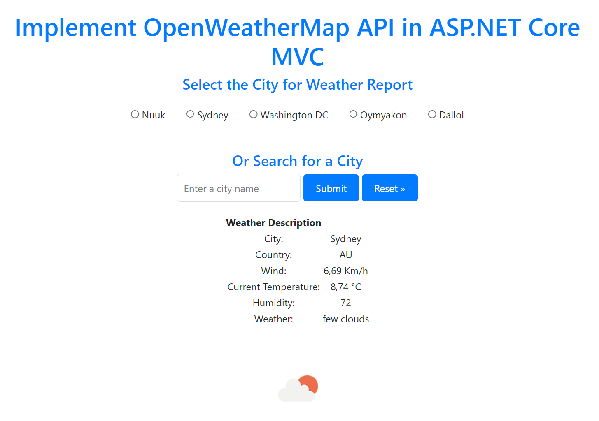

# Weather Forecast API Integration Instructions

## 1. Controller Setup:
   - Add the Weather API to your controller named "WeatherController."
   - **Use the free API from [OpenWeatherMap](https://openweathermap.org/appid)**
   - Use the following code:
     ```csharp
     private readonly string apiKey = "Insert API Key Here";
  # Weather Forecast API Integration Instructions

## 2. API Request:
   - Insert your API key and a city name into this URL to get weather information in JSON format:
     ```
     https://api.openweathermap.org/data/2.5/weather?q={city name}&appid={API key}
     ```

## 3. JSON Formatting:
   - For better readability, paste the JSON response into a JSON viewer like [CodeBeautify](https://codebeautify.org/jsonviewer).

## 4. Integration:
   - Incorporate the code into your C# project.

## Changing Preset Cities in WeatherController:

To modify the preset cities in the WeatherController file, follow these steps:

1. Open the WeatherController.cs file in your project.

2. Locate the `cities` dictionary within the WeatherController class. This dictionary contains the preset cities along with their corresponding OpenWeatherMap API city codes.

   ```csharp
   private readonly Dictionary<string, string> cities = new Dictionary<string, string>
   {
       {"Nuuk", "3421319"},
       {"Sydney", "2147714"},
       {"Washington DC", "4140963"},
       {"Oymyakon", "2122311"},
       {"Dallol", "2318534"}
   };
   ```
   To change a preset city, find the OpenWeatherMap API city code for the desired city. Replace the existing city name and API code with the new values.

   ```csharp
   {"City", "City Code"};  
   ```
3. Save the changes to the WeatherController.cs file.    



Note: Replace "Insert API Key Here" with your actual OpenWeatherMap API key.

Enjoy using the Weather Forecast API in your project!
